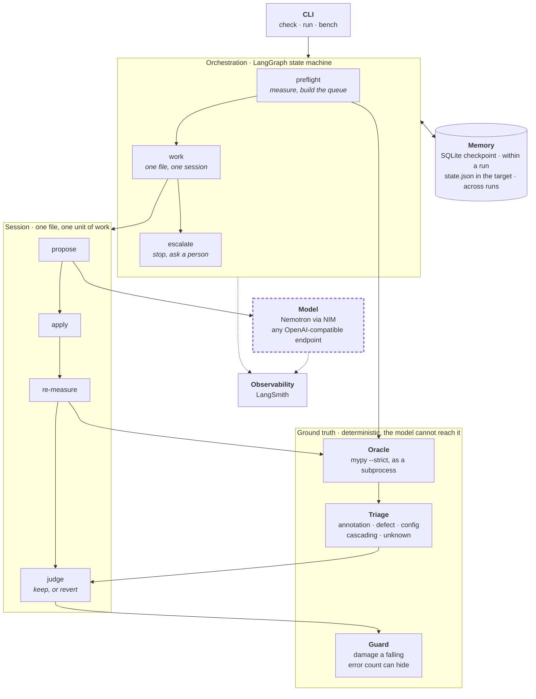

# ratchet

[](https://github.com/Doondi-Ashlesh/ratchet/actions/workflows/ci.yml)

A harness for long-running LLM agents, built around a progress metric that can only move one way.

---

## The problem

An agent asked to "fix the type errors" will fix some of them and quietly suppress the rest. The error count goes down. Nothing improved.

You cannot prompt your way out of this. A model told not to write `# type: ignore` mostly complies, and "mostly" is not a property you can build on. Enforcement has to be a deterministic check that the model does not control.

Ratchet is that check, plus the machinery around it.

---

## Architecture



The dashed box is the only component that is not deterministic, and it is the only one with no path into the ground-truth group. Everything it produces is checked by something it cannot reach: the oracle for what the error count actually did, the triage rules for whether the work was ever the agent's to attempt, the guard for the damage a falling error count can hide.

---

## How it works

One session, one file:

```
run_mypy   ->  measure        what is wrong
classify   ->  triage         who may touch it
agent      ->  propose        the model's only job
session    ->  apply          write it to disk
run_mypy   ->  re-measure     what happened
gate       ->  judge          keep it, or revert byte for byte
```

Every step except `propose` is deterministic. The model proposes; the harness disposes.

A codebase needs many sessions, and the loop over them is a LangGraph state machine rather than a `while`:

```
        ┌───────────────┐
START ─→│   preflight   │  measure once, build the queue,
        └───────┬───────┘  drop what history says keeps failing
                │
                ▼
        ┌───────────────┐
        │     work      │◀─┐  one file, one session
        └───────┬───────┘  │
                │──────────┘  queue not empty
                │
       ┌────────┴────────┐
       ▼                 ▼
  ┌──────────┐         END
  │ escalate │  nothing succeeded; stop and ask a person
  └──────────┘
```

A `while` loop would run these sessions. It would not survive being killed, would not resume where it stopped, and would have no pause point a human could approve at. Checkpointing, resumption and `interrupt_before` are framework features here rather than machinery to build and then prove correct.

### Triage

Not every error is work an agent should attempt. Errors are routed by what it would actually take to fix them:

| Category | Meaning | Goes to |
|---|---|---|
| `annotation` | types are missing, the code is fine | the agent |
| `defect` | mypy believes the code is **wrong** | a human |
| `config` | unresolved import; no source edit helps | fix first, re-measure |
| `cascading` | downstream of a config error | nobody, fix the root |
| `unknown` | no rule for this code | a human, never guessed at |

The default is `unknown`, never a workable category. An agent handed an error it cannot fix will silence it instead, which is exactly the failure this exists to prevent.

### The gate

On a source-editing session, the worked category must fall and **no** category may rise.

Judging the net total is not enough, because it lets a session trade errors between categories and still look like progress. Fixing several annotations while introducing a couple of unclassifiable errors is a net gain by the total and a loss by every other measure.

Config sessions are the exception. Fixing an unresolved import changes what mypy can *see*, so errors that appear were always there. A rising total is allowed there and only there.

### Retry

A rejected attempt is retried with the specific diagnostics it introduced, bounded, always starting again from the original file rather than patching its own broken output. Exhausting the attempts is an escalation with a record of what was tried, not a silent give-up.

---

## Install

```bash
git clone https://github.com/Doondi-Ashlesh/ratchet.git
cd ratchet
python -m venv .venv && .venv/Scripts/activate      # Windows
pip install -e ".[dev]"
```

`ratchet check` has **no third-party runtime dependencies**. The agent needs one:

```bash
pip install -e ".[agent]"
```

---

## Usage

### Measure a codebase

```bash
ratchet check path/to/package
```

Reports the error count in each triage category, and ends with the one next step that follows from them. Config errors come first when present, since they hide errors mypy cannot see and clear their cascading errors for free.

Exit codes follow mypy and ruff, so it composes into a pipeline:

| Code | Meaning |
|---|---|
| `0` | nothing to report |
| `1` | errors found |
| `2` | the tool itself could not run |

That third one matters. A pipeline has to tell "mypy is not installed" apart from "your code is clean", and both are silence otherwise.

`--json` gives the same result machine-readable.

### Work through a codebase

```bash
ratchet run path/to/package --max-files 3 --deadline 240
```

Each file is reported as kept, reverted or skipped, with the reason, followed by the error count before and after.

| Flag | Why it exists |
|---|---|
| `--max-files` | bound the blast radius of an unattended run |
| `--max-attempts` | per-file retry budget |
| `--max-failures` | stop dispatching a file that has failed this often *across runs* |
| `--order` | `worst` moves the count fastest, `smallest` is likelier to succeed |
| `--deadline` | seconds; stop dispatching past this and report what was earned |
| `--checkpoint` | SQLite path, so a killed run resumes instead of restarting |
| `--thread` | which run to resume |

`--deadline` is the one that is not obvious. A session's wall-clock cost is not predictable from anything visible beforehand, because it is driven by how much the model reasons rather than by the size of the file. No file-size heuristic catches that. Bounding the whole run does, and an unattended run that stops on its own terms still reports what it earned.

### Memory across runs

Every verdict is written to `.ratchet/state.json` **in the target repository**, and it is meant to be committed. A file that keeps failing is not dispatched again, and the reason it is being skipped travels with the code, visible in a diff, rather than living in a cache on whoever ran it last.

### Observability

```bash
export LANGSMITH_TRACING=true
export LANGSMITH_API_KEY=...
export LANGSMITH_PROJECT=ratchet
```

Traces go to LangSmith, with token counts and latency per call and the graph node that spent them. That is what makes "which file ate the budget" a query rather than a guess.

Two things are deliberate. Graph nodes carry no tracing decorator, because LangGraph already opens a span per node and decorating them too records everything twice. And the OpenAI client is wrapped with `langsmith.wrappers.wrap_openai` rather than hand-instrumented, so usage is read by the code that owns the response shape.

Instrumentation is wrapped in a deliberately blind `except`. Traces are diagnostic, the completion is the product, and observability must never be able to break the thing it observes.

### Run one session

```python
from ratchet.session import run_session

result = run_session(target="src/mypackage", path="src/mypackage/graph.py")

print(result.kept)      # was the work kept
print(result.reason)    # why
print(result.attempts)  # how many tries
print(result.proposed)  # what the model actually wrote, kept even on rejection
```

Configure the model:

```bash
NVIDIA_API_KEY=...                                   # required for live calls
NIM_BASE_URL=https://integrate.api.nvidia.com/v1     # default
RATCHET_MODEL=nvidia/nemotron-3-super-120b-a12b      # default
```

Any OpenAI-compatible endpoint works. The provider is a base-URL change.

---

## Status

Early, but it runs unattended against a real model and a real codebase.

**Working:** measurement, triage, the gate, bounded retry, the multi-file loop, cross-run memory, checkpoint and resume, a wall-clock budget, LangSmith tracing, and the CLI.

**Not built yet:**

- The human-in-the-loop pause exists on the compiled graph but is not exposed by `ratchet run`.
- No clean-tree precondition on `run`, so a rejected session could discard uncommitted work in the file it touched.
- A second oracle: running the target's own linter, so the guard stops enumerating style rules it learned one incident at a time.
- A separate evaluator model.

The measured baseline is not yet a property of the target alone, because mypy runs in Ratchet's environment. Installing a package into Ratchet changes what it reports about your repo.

---

## Design notes

Every rule above came out of a measurement that contradicted an expectation. The [failure log](docs/failure-log.md) records those individually and is the most useful document in this repository. The principles they produced:

- **A prompt is a request; only a check is enforcement.** Every constraint that matters is verified by code the model does not control.
- **Fail closed.** An error with no rule is routed to a human, never to the category that looks closest.
- **Fix the class, not the instance.** A rule scoped to one symptom holds until the same cause surfaces somewhere else, which it does.
- **Tools never raise into the agent.** Every outcome, including failure, comes back as a typed result with a stable `error_type`. An exception gives a model a stack trace; typed failure gives it a decision.
- **mypy runs as a subprocess**, not an imported API, which buys crash isolation, an enforceable timeout, and version independence from the target.
- **The whole target is re-measured**, not just the edited file. A change in one file can create errors in another, and a session that checked only its own would export the mess to a neighbour and report success.
- **Rejected work is reverted byte for byte.** Reads and writes disable newline translation; without that, a "revert" on an LF repo differs on every line.
- **Rejected proposals are kept.** A refused attempt is evidence the next one needs, not garbage.

---

## Development

```bash
ruff check .
mypy
pytest -q
```

All three run in CI on every pull request, and `main` is protected.

`mypy --strict` is enforced on Ratchet itself. A tool that drives other codebases to strict-clean while exempting its own would not deserve to be believed.
